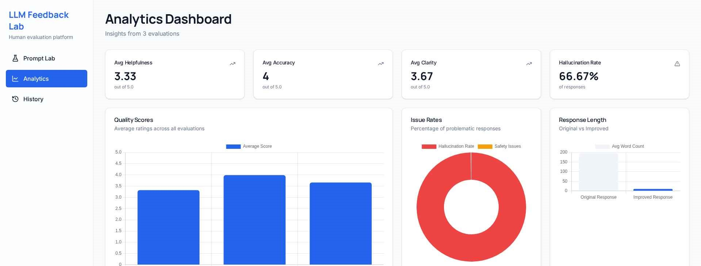

```markdown
# LLM Human Feedback Lab

A full‑stack web app that simulates a human‑in‑the‑loop evaluation workflow for Large Language Models (LLMs). Users submit prompts, see LLM‑style responses, rate them, and view basic quality insights.

## Features

- Prompt input and generated response view.  
- Human evaluation panel (helpfulness, accuracy, clarity, hallucination flag, safety flag, improved response).  
- Evaluation history page.  
- Analytics dashboard with average scores, issue rates, and response‑length comparison.

## Tech Stack

- **Frontend:** React (JavaScript)  
- **Backend:** FastAPI (Python)  
- **Database:** MongoDB at `mongodb://localhost:27017`

## Screenshots




## Running Locally

**Backend**

```bash
cd backend
pip install -r requirements.txt
uvicorn server:app --reload
```

**Frontend**

```bash
cd frontend
npm install
npm run dev
```

Backend runs on `http://127.0.0.1:8000`, frontend on the port shown in the terminal (commonly `http://localhost:5173`).
